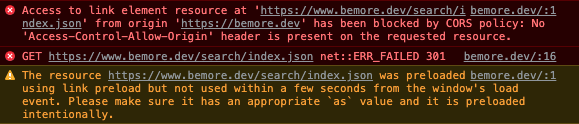

## 로컬에서 되던 검색이 도메인에서는 안된다..?
블로그 만들고 도메인 설정하고 신나게 글을 쓰다가 검색기능이 안되는걸 발견했다. 빌드한 그대로 로컬에서 돌려봤을때는 잘만 되는데..?  
**도메인에서는 다음과 같은 에러메시지가 나오는 상태였다.**

baseURL 설정이 웹에서 요구하는 주소 형태랑 좀 달라서 나타난 문제같았다. 
## 🛠 해결
1. `config.yaml`에서 baseURL을 www.bemore.dev로 바꿔도 달라지지 않았다.
2. CNAME 파일 확인하기  
CNAME 내부 주소 값이 처음 도메인 설정해줄때 www.bemore.dev였는데 빌드하고 나서 bemore.dev로 바꼈던 부분이 생각났다.  
<- Push할 떄마다 페이지가 작동하지 않을수도 있다고 해서 이를 방지하기 위해 static/CNAME을 작성할때  
😈 **`www`를 뺀 apex주소를 썼던거 때문이었다.** 😈

3. static/CNAME  
👉 내용 `www.도메인주소`으로 수정하고 Push

🎉 이제 도메인에서도 제대로 작동한다!

### 참고
[Search works locally but not on domain](https://discourse.gohugo.io/t/search-works-locally-but-not-on-domain/20641)  
["Search" still not functioning with CORS blocking](https://github.com/xiaoheiAh/hugo-theme-pure/issues/14)  

블로그 그만 고치고 글 쓰겠어...