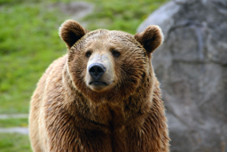
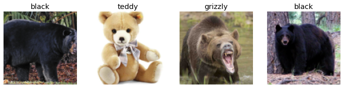
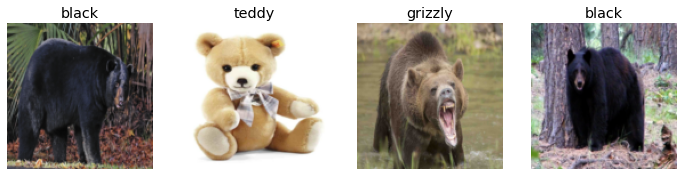
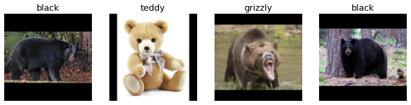
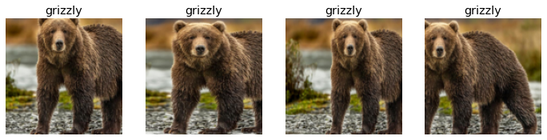
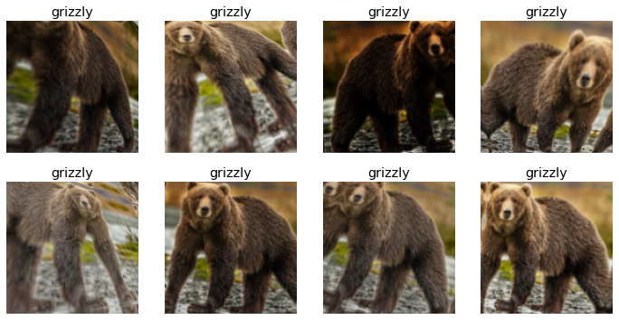
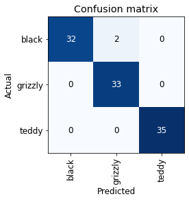
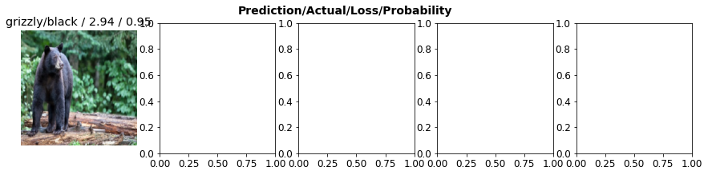

이번 장에서는 분류 모델을 구축하면서 딥러닝의 가능성 및 제한사항을 살펴볼 수 있다. 이 곰돌이가 어떤 곰돌이인지 예측하는 모델을 다뤄봅시다 🐻
## 데이터 다운로드
책에서는 빙 이미지 검색의 데이터를 사용했지만 빙 이미지 검색은 보안키를 요구해서...좀 더 편하게 이미지 데이터를 받아올 방법을 찾아보았다.  
역시 [fastai공식 자료](https://course.fast.ai/images)를 찾아보니 귀찮게 보안키를 요구하지 않는 DuckDuckGo 이미지를 편하게 받아서 쓸 수 있는 방법이 있었다!


```python
!pip install fastbook
```

```python
from fastbook import * 
urls = search_images_ddg('grizzly bear', max_images=100)
len(urls), urls[0]
```


출력:

    (100,
     'https://s3-us-west-2.amazonaws.com/cdn.yellowst.one/animals/grizzly-bear.jpg')


다운로드한 이미지 하나 열어서 확인하면...
```python
download_url(urls[0], 'images/bear.jpg')
im = Image.open('images/bear.jpg')
im.thumbnail((256,256))
im
```


<div>
    <style>
        /* Turns off some styling */
        progress {
            /* gets rid of default border in Firefox and Opera. */
            border: none;
            /* Needs to be in here for Safari polyfill so background images work as expected. */
            background-size: auto;
        }
        .progress-bar-interrupted, .progress-bar-interrupted::-webkit-progress-bar {
            background: #F44336;
        }
    </style>
  <progress value='180224' class='' max='179315' style='width:300px; height:20px; vertical-align: middle;'></progress>
  100.51% [180224/179315 00:00<00:00]
</div>


    

    


각 검색어에서 얻은 모든 URL의 이미지를 fastai가 제공하는 `download_images` 함수로 다운로드 하여 검색어가 이름인 별도의 폴더에 저장한다.
```python
bear_types = 'grizzly', 'black', 'teddy'
path = Path('bears')

if not path.exists():
    path.mkdir()
    for o in bear_types:
        dest = (path/o)
        dest.mkdir(exist_ok=True)
        download_images(dest, urls=search_images_ddg(f'{o} bear', max_images=150))
```


```python
fns = get_image_files(path)
fns[:5]
```


출력:

    (#5) [Path('bears/teddy/00000085.png'),Path('bears/teddy/00000008.jpg'),Path('bears/teddy/00000107.jpg'),Path('bears/teddy/00000168.jpeg'),Path('bears/teddy/00000130.jpg')]


가끔 파일에 오류가 발생할 수 있어서 `verify_images` 함수로 검사
```python
failed = verify_images(fns)
failed
```


출력:

    (#1) [Path('bears/teddy/00000101.png')]


`map` 메서드는 호출 시 인자로 전달된 함수를 컬렉션에 포함된 각 요소에 적용.  
unlink 함수를 사용해 오류가 발생한 모든 요소 삭제.

```python
failed.map(Path.unlink)
```


    (#1) [None]


## 데이터에서 DataLoaders까지
다운로드한 데이터를 `DataLoaders`객체로 만들어 목적에 맞게 학습용과 검증용으로 나눈다.

```python
class DataLoaders(GetAttr):
    def __init__(self, *loaders): self.loaders = loaders
    def __getitem__(self, i): return self.loaders[i]
    train, valid = add_props(lambda i, self: self[i])
```
딱 들어맞는 메서드가 없다면 fastai가 제공하는 데이터블록 사용해 사용자의 상황에 맞는 DataLoaders 객체 생성.

```python
bears = DataBlock(blocks=(ImageBlock, CategoryBlock), 
                  get_items=get_image_files,
                  splitter=RandomSplitter(valid_pct=0.2, seed=42),
                  get_y=parent_label,
                  item_tfms=Resize(128))
```
- `bocks=(독립변수, 종속변수)`  
- `get_image_files`: 인자로 주어진 경로에 포함된 모든 이미지 목록 찾아 반환  
- `splitter=RandomSplitter(valid_pct=0.2, seed=42)`  
  - `seed`: 목록이 시작되는 지점. 난순을 생성하는 기준값이 매번 바뀌기 때문에 주피터 노트북을 실행할 때마다 각 데이터셋에 포함된 이미지가 달라지는 문제 해결하기 위해 제시됨.

- `get_y=데이터셋 레이블링에 쓰일 함수`  
  - `parent_label`: 파일이 저장된 폴더명 반환  
- `item_tfms`: 모델을 학습시킬 이미지를 텐서로 구성하려면 모든 이미지의 크기가 같아야 한다. 이미지의 크기를 똑같이 맞추는 변형방법. 

```python
dls = bears.dataloaders(path)
```
배치 요소 중 일부 확인

```python
dls.valid.show_batch(max_n=4, nrows=1)
```


    

    

이미지 크기를 동일하게 맞추려 잘라내다가 일부가 유실될 수도 있다. 이미지를 잘라내지 않고 크기를 맞추는 다음 방법들이 있다.  
1) 찌그러뜨리기

```python
bears = bears.new(item_tfms=Resize(128, ResizeMethod.Squish))
dls = bears.dataloaders(path)
dls.valid.show_batch(max_n=4, nrows=1)
```


    

    


2. 빈 곳을 0으로 채우는 방법
```python
bears=bears.new(item_tfms=Resize(128, ResizeMethod.Pad, pad_mode='zeros'))
dls=bears.dataloaders(path)
dls.valid.show_batch(max_n=4, nrows=1)
```


    

    
위의 두 방법은 이미지를 비현실적으로 변형해서 모델이 실제와는 다른 형태를 학습할 수도 있다. 이미지 크기를 맞추기 위해서 이미지 일부를 잘라내거나, 찌그러뜨리거나, 늘리기, 불필요한 빈 공간을 많이 만들어내는 방법은 모델의 계산 처리에 큰 낭비를 야기시킨다. 이는 유효해상도가 낮아지는 결과로 이어질 수 있다.  

실전에서는 이미지의 특정 부분을 **무작위**로 선택하여 잘라내는 방식을 보편적으로 사용한다. 에포크마다 무작위로 각 이미지의 다른 부분을 선택해 모델이 각 이미지의 서로 다른 위치에서 드러난 특징에 집중하여 다양성을 인식할 수 있는 방향으로 학습될 수 있도록 한다. 


```python
bears = bears.new(item_tfms=RandomResizedCrop(128, min_scale=0.3))
dls=bears.dataloaders(path)
dls.train.show_batch(max_n=4, nrows=1, unique=True)
```
`min_scale`: 매번 이미지의 얼마나 많은 영역을 선택할지 결정!  
`show_batch`함수의 `unique`인자: 동일 이미지에서 반복해서 적용되는 변형으로 만들어지는 서로 다른 이미지 확인
    

    

## 데이터 증강
입력 데이터를 임의로 변형해 새로운 데이터를 생성하는 기법. 변형된 결과들은 서로 다른 개체를 만들지만, 데이터 자체의 의미를 벗어나서는 안된다. 
- 회전
- 뒤집기
- 원근 뒤틀기
- 명도 바꾸기
- 채도 바꾸기..등


```python
bears = bears.new(item_tfms=Resize(128), batch_tfms=aug_transforms(mult=2))
dls = bears.dataloaders(path)
dls.train.show_batch(max_n=8, nrows=2, unique=True)
```
`batch_tfms`: GPU에서 배치 단위로 적용할 변형 지정하는 인자  
`aug_transforms`: 자연스러운 사진에는 이미 잘 작동한다고 알려진 표준적인 데이터 증강 목록 반환  

    

    


## 모델 훈련과 훈련된 모델을 이용한 데이터 정리


```python
bears = bears.new(item_tfms=RandomResizedCrop(224, min_scale=0.5),
                  batch_tfms=aug_transforms())
dls = bears.dataloaders(path)
```


```python
learn = cnn_learner(dls, resnet18, metrics=error_rate)
learn.fine_tune(4)
```
출력:

<table border="1" class="dataframe">
  <thead>
    <tr style="text-align: left;">
      <th>epoch</th>
      <th>train_loss</th>
      <th>valid_loss</th>
      <th>error_rate</th>
      <th>time</th>
    </tr>
  </thead>
  <tbody>
    <tr>
      <td>0</td>
      <td>1.156789</td>
      <td>0.205025</td>
      <td>0.078431</td>
      <td>00:31</td>
    </tr>
  </tbody>
</table>


<table border="1" class="dataframe">
  <thead>
    <tr style="text-align: left;">
      <th>epoch</th>
      <th>train_loss</th>
      <th>valid_loss</th>
      <th>error_rate</th>
      <th>time</th>
    </tr>
  </thead>
  <tbody>
    <tr>
      <td>0</td>
      <td>0.089115</td>
      <td>0.056106</td>
      <td>0.039216</td>
      <td>00:31</td>
    </tr>
    <tr>
      <td>1</td>
      <td>0.086506</td>
      <td>0.044664</td>
      <td>0.019608</td>
      <td>00:30</td>
    </tr>
    <tr>
      <td>2</td>
      <td>0.071595</td>
      <td>0.076065</td>
      <td>0.019608</td>
      <td>00:30</td>
    </tr>
    <tr>
      <td>3</td>
      <td>0.060480</td>
      <td>0.062316</td>
      <td>0.019608</td>
      <td>00:30</td>
    </tr>
  </tbody>
</table>


```python
interp = ClassificationInterpretation.from_learner(learn)
interp.plot_confusion_matrix()
```

오차행렬:

    

    
오류가 발생하는 곳 원인 파악해야 데이터셋인지, 모델 자체 문제인지 알 수 있다. 

손실 기준으로 이미지 정렬해서 확인하기


```python
interp.plot_top_losses(5, nrows=1)
```


    

    

### ImageClassifierCleaner로 시각적으로 확인해서 데이터 정제
⚠️ Colab환경에서 실습할 때 ImageClassifier not found Error 발생할 수 있다. 
[Fastai2’s ImageClassifierCleaner to clean image data is not showing up in Colab](https://forums.fast.ai/t/fastai2s-imageclassifiercleaner-to-clean-image-data-is-not-showing-up-in-colab/66125) 참고해 위젯 모듈을 임포트 해줘야했다. fastai2가 아니라 fastai로 해야 문제가 없었다.


```python
from fastai.vision.widgets import *
```


```python
cleaner = ImageClassifierCleaner(learn)
cleaner
```


위젯으로 확인했을 때, 라벨링이 잘못되어 있는 이미지는 레이블을 바꿔주거나 삭제. ImageClassifierCleaner가 해당 이미지를 실제 삭제하거나 레이블을 변경하지는 않는다. 변경이 필요한 목록의 색인번호를 반환한다.


```python
for idx in cleaner.delete():cleaner.fns[idx].unlink()
```
삭제를 선택한 모든 이미지 삭제.

```python
for idx, cat in cleaner.change(): shutil.move(str(cleaner.fns[idx]), path/cat)
```
레이블 변경을 선택한 모든 이미지 알맞은 범주의 디렉터리로 옮긴다. 
## 모델을 온라인 애플리케이션으로 전환하기

먼저, 학습한 모델 파일 형태로 서버에 저장한다. 모델은 `구조`, `학습된 파라미터`로 구성된다. 
```python
learn.export()
```
모델의 구조 및 파라미터 파일로 저장

```python
path = Path()
path.ls(file_exts='.pkl')
```
확인:


    (#1) [Path('export.pkl')]


### 추론
모델을 예측에 사용하기


```python
learn_inf = load_learner(path/'export.pkl')
```


```python
learn_inf.predict('images/bear.jpg')
```


결과: 


    ('grizzly', TensorBase(1), TensorBase([9.1902e-08, 1.0000e+00, 5.0465e-07]))
(예측된 범주, 예측된 범주의 인덱스, 범주 별 확률)


```python
learn_inf.dls.vocab
```

DataLoaders의 vocab에 저장된 모든 범주 목록 순서 확인


    ['black', 'grizzly', 'teddy']

범주 인덱스도 맞게 된 것을 확인할 수 있다. 

## 어플리케이션에 모델 서빙
`predict` 메서드로 모델 예측 기능을 만들어서 구동해봅시다. 간단하게 주피터 노트북에서 위젯으로 웹 어플리케이션을 만들어볼 수 있다. 
1. 예측하고 싶은 이미지 파일 업로드하는 버튼 만들기
```python
btn_upload = widgets.FileUpload()
btn_upload
```


    FileUpload(value={}, description='Upload')


업로드한 이미지 확인하기

```python
img = PILImage.create(btn_upload.data[-1])
```

```python
out_pl = widgets.Output()
out_pl.clear_output()
with out_pl: display(img.to_thumb(128, 128))
out_pl
```
이미지 확인


해당 이미지에 대한 예측 실행
```python
pred, pred_idx, probs = learn_inf.predict(img)
```
Label 위젯으로 예측 결과 출력하기

```python
lbl_pred = widgets.Label()
lbl_pred.value = f'Prediction: {pred}; Probability: {probs[pred_idx]:.04f}'

lbl_pred
```
출력:

    Label(value='Prediction: grizzly; Probability: 1.0000')

2. 예측하기 버튼 만들기


```python
btn_run = widgets.Button(description='Classify')
btn_run
```


    Button(description='Classify', style=ButtonStyle())


클릭 이벤트 핸들러 정의하기

```python
def on_click_classify(change):
    img = PILImage.create(btn_upload.data[-1])
    out_pl.clear_output()
    with out_pl: display(img.to_thumb(128, 128))
    pred, pred_idx, probs = learn_inf.predict(img)
    lbl_pred.value = f'Prediction: {pred}; Probability: {probs[pred_idx]:.04f}'

btn_run.on_click(on_click_classify)
```
3. 만든 위젯들 나열. GUI 완성

```python
VBox([widgets.Label('Select your bear!'),
      btn_upload, btn_run, out_pl, lbl_pred])
```


    VBox(children=(Label(value='Select your bear!'), FileUpload(value={'스크린샷 2021-11-30 오후 10.25.08.png': …


이상 곰 이미지 분류 모델에 대한 간단한 연습을 해볼 수 있었다.